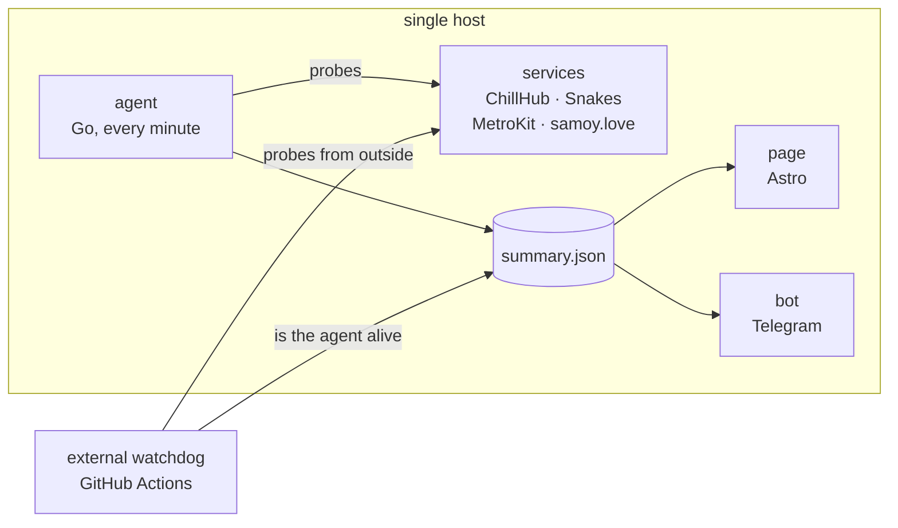

[Русский](README.md) · **English**

# status.samoy.love

Status page for the four services behind [samoy.love](https://samoy.love) —
**https://status.samoy.love**

An agent on the server itself collects the data: that is the only place from
which systemd units and deployed versions are visible. A GitHub Actions
workflow probes the same endpoints from outside, because a host that is down
cannot report that it is down. Which of the two observers speaks in Telegram
is decided explicitly, rather than by whoever gets there first.

`Go` · `Astro` · `Node` · `GitHub Actions` · `systemd`

## What it watches

`samoy.love` reads as the owner's surname. Four services live under that
domain on a single host, and this page watches them:

|                |                                                    |                                                     |
| -------------- | -------------------------------------------------- | --------------------------------------------------- |
| **ChillHub**   | [launcher.samoy.love](https://launcher.samoy.love) | game launcher: site, build delivery, client updates |
| **Snakes**     | [snakes.samoy.love](https://snakes.samoy.love)     | multiplayer territory capture                       |
| **MetroKit**   | [metro.samoy.love](https://metro.samoy.love)       | offline PWA with the Moscow metro map               |
| **samoy.love** | [samoy.love](https://samoy.love)                   | personal page and project showcase                  |

## How it works

Three parts, each doing what the others cannot.

**The agent** (`agent/`, Go) walks the services every minute, reads systemd
unit states and deployment dates, accumulates history and writes a ready-made
JSON next to the page. It lives on the same host as the services — that is
the only way to see units and versions, but it also means the page is
unreachable when the host is down.

**The bot** (`bot/`, Go) answers the owner's commands in Telegram and reports
outages, recoveries and new versions. It runs no checks of its own: it reads
the same `summary.json` the page does. Two independent probes would drift
apart, and deciding which one to trust would fall to a human.

**The external watchdog** (`scripts/probe.mjs`, GitHub Actions) probes the
same endpoints from outside. It is the only part that survives the server
going down.

The check history is readable without visiting the site: the watchdog commits
it straight into the repository, under `data/`.

## Who speaks in Telegram

The bot and the watchdog write to the same chat, so the voice between them is
split explicitly — otherwise every outage would arrive twice.

**While the agent keeps the data fresh, the bot reports and the watchdog stays
quiet.** Fresh data means the server is alive; the bot is restarted by systemd
and knows more — units, versions, reminders about an ongoing outage. The
watchdog still records history and incidents, it just does not duplicate the
notifications.

**As soon as the agent goes silent, or the page is unreachable from outside,
the voice passes to the watchdog.** At that moment the bot is most likely
silent too: either the host is down or it has no network.

The dead-man switch deliberately exists in both. The bot sees a stale file on
the server; the watchdog sees the absence of fresh data from outside. When the
whole host goes down only the second one is left, and replacing it with a
guess — "the bot has surely already written" — is not an option.

"Slow" wakes nobody. The service does answer, just above the threshold; that
is visible on the page and in the project's verdict, but it is not a reason to
send a message at night.

## Why HTTP 200 proves nothing

A service answers 200 with a "database unavailable" page. Or with an empty
body. Or after eight seconds. Or with a redirect to an unrelated host that
also answered 200. Judged by the status code alone, all of this looks healthy.

So a check is described more broadly: a marker in the body, `Content-Type`, a
latency threshold, the final host after redirects, a criticality flag and the
user-facing consequence of the failure.

**Criticality.** A project's verdict is computed from critical checks only.
Previously all checks weighed the same, and an internal admin API going down
was described in the same words as the game server without which no matches
run. Non-critical checks stay visible, but they no longer spoil the verdict.

**Scale of an outage.** There is a step between "partial" and "total":
otherwise "total" would require every single check to be down, and three
completely dead projects out of four would be called the same thing as one
flapping secondary check.

**Confirmation.** A failure is only accepted after a repeated request. A
single dropped connection no longer opens an incident or wakes up Telegram:
it is not only the service that flickers, but also the road to it.

**Certificates.** "Expired", "fails validation" and "could not reach" are told
apart. Any of these used to produce the same missing badge — precisely when
knowing about the certificate matters most.

### Honest uptime

Uptime is computed over a calendar window, not over the number of accumulated
buckets. A bucket only appears when the agent ran: "over 90 days" used to take
the last ninety buckets, so a week of agent downtime quietly stretched the
window to ninety-seven days — and that downtime even improved the number,
because it contained no failed probes. Days without measurements now stay as
gaps, both on the bar and in the arithmetic.

The daily bar has gradations rather than just "100% / 0% / everything else": a
day with a single failed minute out of 1440 and a day that was down for half
its length no longer look the same.

### Stale data

If `updated` in `summary.json` is older than five minutes, the page says the
data is stale in a separate grey state instead of presenting the last known
status as current. A frozen agent must not look like "everything works".

But somebody still has to open the page, so the watchdog additionally fetches
`summary.json` from outside and writes to Telegram if the agent has been
silent for more than ten minutes.

## The bot and the mini app

Every message carries inline buttons; screens are switched by **editing the
same message** rather than sending a new one. The availability bar under a
project is computed from the worst critical check of each day: if the game
server was down that day, the day is bad even though the site was up.

"Open" shows the page inside Telegram — a separate compact build
(`src/pages/tg.astro`), not a shrunken copy of the big one. It picks up the
user's Telegram theme. The logic of what the data means is shared with the
full page (`src/lib/status.ts`), so the verdicts cannot drift apart.

## Further reading

Deployment, provisioning and the check configuration reference are documented
in Russian only: [docs/DEPLOY.md](docs/DEPLOY.md),
[docs/CONFIG.md](docs/CONFIG.md).

This repository is meant for reading: it is personal infrastructure, and pull
requests are not expected. Questions and remarks —
[alex@samoy.love](mailto:alex@samoy.love).
