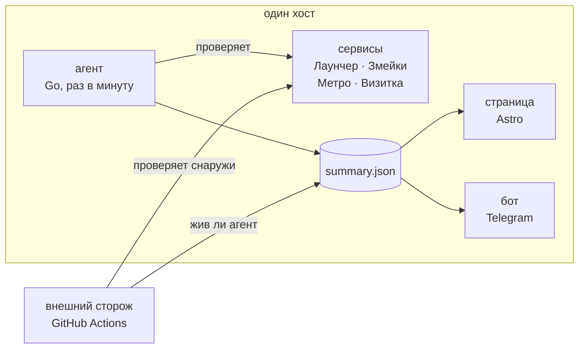

**Русский** · [English](README.en.md)

# status.samoy.love

Статус-страница четырёх сервисов [samoy.love](https://samoy.love) — **https://status.samoy.love**

Данные собирает агент на самом сервере: только оттуда видно systemd-юниты и
выкаченные версии. Те же эндпоинты параллельно обходит воркфлоу в GitHub
Actions — упавший хост не может сообщить, что он упал. Кто из двух
наблюдателей говорит в Telegram, решено явно, а не «кто первый успел».

`Go` · `Astro` · `Node` · `GitHub Actions` · `systemd`

[](https://github.com/tr0llex/status.samoy.love/actions/workflows/ci.yml)
[](https://codecov.io/gh/tr0llex/status.samoy.love)
[](https://status.samoy.love)

## За чем следит

`samoy.love` читается как фамилия владельца. Под этим доменом живут четыре
сервиса на одном хосте — за ними и следит эта страница:

|             |                                                    |                                                    |
| ----------- | -------------------------------------------------- | -------------------------------------------------- |
| **Лаунчер** | [launcher.samoy.love](https://launcher.samoy.love) | ChillHub: сайт, раздача сборок, обновление клиента |
| **Змейки**  | [snakes.samoy.love](https://snakes.samoy.love)     | Snakes: мультиплеерный захват территории           |
| **Метро**   | [metro.samoy.love](https://metro.samoy.love)       | офлайн-схема московского метро, работает без сети  |
| **Визитка** | [samoy.love](https://samoy.love)                   | личная страница и витрина проектов                 |


## Как устроено



Три части, каждая делает то, чего не могут остальные.

**Агент на сервере** (`agent/`, Go) — раз в минуту обходит сервисы, читает
состояние systemd-юнитов и даты выкаток, копит историю и складывает готовый
JSON рядом со страницей. Он живёт на том же хосте, что и сами сервисы: только
так видно юниты и версии — но при падении хоста страница будет недоступна.

**Бот** (`bot/`, Go) — отвечает владельцу в Telegram на команды и сам сообщает
о падениях, восстановлениях и новых версиях. Своих проверок не делает: читает
тот же `summary.json`, что и страница. Два независимых обхода расходились бы
во времени, и решать, кому верить, пришлось бы человеку.

**Внешний сторож** (`scripts/probe.mjs`, GitHub Actions) — обходит те же
эндпоинты снаружи. Это единственное, что переживает падение сервера.

```
agent/main.go        агент: проверки, systemd, версии, история
bot/                 телеграм-бот: команды, кнопки, уведомления
config/status.json   единый конфиг для агента и сторожа
scripts/probe.mjs    внешний сторож
src/                 страница и мини-приложение (Astro)
docs/                выкатка и описание конфига
```

Историю проверок можно читать, не заходя на сайт: сторож коммитит её в ветку
[`status-data`](https://github.com/tr0llex/status.samoy.love/tree/status-data).
В `main` она не попадает — пять коммитов в час в основную ветку это шум,
из-за которого не видно правок кода.

## Кто говорит в Telegram

Бот и сторож пишут в один чат, поэтому голос между ними разделён явно —
иначе на каждое падение прилетало бы по два одинаковых сообщения.

**Пока агент обновляет данные, о сервисах пишет бот, а сторож молчит.**
Свежие данные означают, что сервер жив; бот перезапускается systemd
(`Restart=always`) и знает больше — юниты, версии, напоминания о длящемся
простое. Историю и инциденты сторож при этом ведёт как обычно, просто не
дублирует уведомления.

**Как только агент замолчал или страница недоступна снаружи — голос
переходит к сторожу.** В этот момент бот, скорее всего, молчит и сам: либо
лежит хост, либо у него нет сети.

|                                | бот            | сторож             |
| ------------------------------ | -------------- | ------------------ |
| падения и восстановления       | пока агент жив | когда агент молчит |
| напоминание о длящемся простое | да             | —                  |
| смена версии                   | да             | —                  |
| сроки и годность сертификатов  | —              | всегда             |
| «агент замолчал»               | через 5 мин    | через 10 мин       |
| ответы на команды              | да             | —                  |

Дед-мэн намеренно есть у обоих: бот видит несвежий файл на самом сервере,
сторож — отсутствие свежих данных снаружи. Когда падает весь хост, остаётся
только второй, и подменять его догадкой «бот наверняка уже написал» нельзя.
Пороги разные не случайно: бот читает файл локально и может быть строгим, а
у сторожа cron раз в пять минут, и порог ниже десяти давал бы ложные тревоги.

«Медленно» не будит никого. Сервис отвечает, просто дольше порога; это видно
на странице и в вердикте проекта, но не повод для сообщения ночью.

## Почему код 200 ничего не доказывает

Сервис отвечает 200 и страницей «База данных недоступна». Или пустым телом.
Или за восемь секунд. Или редиректом на посторонний хост, который тоже
ответил 200. По одному коду всё это выглядит здоровьем.

Поэтому проверка описывается шире: маркер в теле, `Content-Type`, порог
времени, конечный хост после редиректов, признак критичности и текст
последствия для пользователя — [docs/CONFIG.md](docs/CONFIG.md).

**Критичность.** Вердикт проекта считается по критичным проверкам. Раньше все
весили одинаково, и падение внутренней админки описывалось теми же словами,
что и падение игрового сервера, без которого не идут матчи. Второстепенные
видны отдельной плашкой и в списке сбоев, но вердикт не портят.

**Медленно** — третье состояние, а не оттенок «работает». В аптайм оно идёт
как доступность (иначе цифру не сравнить с собственной историей), но на
странице и в вердикте проекта видно отдельно.

**Масштаб сбоя.** Между «частичным» и «массовым» есть ступень: «массовый»
требовал бы, чтобы легли все проверки до единой, и три полностью мёртвых
проекта из четырёх назывались бы тем же словом, что и одна моргнувшая
второстепенная проверка.

**Подтверждение.** Сбой признаётся только после повторного запроса. Один
оборванный коннект не открывает инцидент и не будит Telegram: моргает не
только сервис, но и дорога до него.

**Сертификат.** Различаются «истёк», «не проходит проверку» и «не
достучались». Раньше любая беда давала одинаковое отсутствие плашки — ровно
тогда, когда о сертификате важнее всего знать.

### Честный аптайм

Аптайм считается по календарному окну, а не по числу накопленных корзин.
Корзина заводится только когда агент отработал: раньше «за 90 дней» брало
девяносто последних корзин, и недельный простой агента незаметно растягивал
окно на девяносто семь суток, а сам простой ещё и улучшал цифру — плохих
замеров в нём не было. Сутки без замеров теперь остаются дырками и на шкале,
и в счёте; рядом написано, за сколько дней из девяноста данные вообще есть.

Полоска дня различает ступени, а не только «100% / 0% / всё остальное»: день
с одной сбойной минутой из 1440 и день, лежавший наполовину, больше не
выглядят одинаково.


### Устаревание данных

Если `updated` в `summary.json` старше пяти минут, страница говорит «данные
устарели» отдельным серым состоянием, а не показывает последний известный
статус как текущий. Замерший агент не должен выглядеть как «всё работает».

Но страницу надо ещё открыть, поэтому сторож дополнительно ходит за
`summary.json` снаружи и пишет в Telegram, если агент замолчал дольше десяти
минут или статус-страница вовсе не отвечает.

## Что показывается

Сверху — одно утверждение о состоянии всего хозяйства и три числа под ним.
Если что-то лежит, список сломанного идёт отдельным блоком выше проектов:
искать красную строку среди зелёных не нужно.

Проекты сверху вниз по важности. Здоровые свёрнуты, проблемные раскрыты сами —
десять строк со стопроцентным аптаймом не должны заслонять единственную, где
он не стопроцентный. Ручное раскрытие переживает обновление данных.

Внутри проекта — проверки со шкалой доступности за 90 дней, аптайм за 24 часа /
7 дней / 90 дней, время ответа и остаток срока TLS-сертификата. Ниже —
состояние служб и что именно сейчас выкачено.

Внутренние метрики (диск, память, счётчики рестартов) наружу не отдаются.

Тема следует за системной, точное московское время видно по наведению на
любую дату, а без JavaScript остаётся ссылка на исходный JSON.

### Версии и changelog

Версии берутся из `/version.json`, который кладёт общий пайплайн: отвечает
сам работающий сервис, а не диск, — значит показано то, что реально крутится.
Там, где сервис такого файла не отдаёт, версия читается из имени каталога
релиза.

Агент копит историю выкаток — по 20 последних версий на каждую цель. Откат на
предыдущую версию попадает в историю отдельной записью, а не проглатывается
как «уже видели». В истории два времени: когда собрали и когда агент впервые
увидел версию работающей. Показывается второе — «когда поехало» и «когда
собрали» разные вопросы.

## Метрики Prometheus

Тот же обход агент выгружает в формате Prometheus — файлом
`/var/lib/node_exporter/textfile/status-agent.prom` (путь меняется флагом
`-metrics`, пустое значение выключает выгрузку). Читает его textfile-коллектор
node_exporter из `metrics.samoy.love`; наружу ничего не открывается — ни порта,
ни маршрута в nginx.

HTTP-эндпоинта нет намеренно: агент — oneshot по таймеру, между запусками
процесса не существует, и слушать порт некому. Файл же переживает паузу.

Отдаются: доступность каждой проверки, время ответа, код, аптайм за окна,
дни до истечения сертификата, состояние юнитов, открытые и завершённые
инциденты, а также время и длительность самого обхода — по ним видно, что
данные свежие. Замерший таймер иначе выглядит как «всё зелено».

Бот считает отправленные уведомления и обработанные команды: молчащий бот и
бот, у которого не уходят сообщения, снаружи выглядят одинаково.

## Бот

**https://t.me/samoy_love_bot** — отвечает только владельцу, чужие сообщения
игнорирует молча: любой ответ незнакомцу подтверждает, что бот жив и слушает.

Под каждым сообщением — кнопки: «Статус», «Версии», «Инциденты», «Обновить»
и «Открыть». Экраны переключаются **правкой того же сообщения**, а не новым:
иначе за неделю переписка превращается в ленту из полусотни почти одинаковых
карточек.

```
🟠 Частичный сбой
6/7 ключевых проверок в норме · 1 второстеп. не в порядке

🔴 Змейки · Игровой сервер
   Матчи не идут: зайти в игру нельзя, текущие партии оборваны
   connect: connection refused
   недоступен 3 ч

🟢 Лаунчер 3/3
🟩🟩🟩🟩🟩🟩🟩🟩🟩🟩🟩🟩🟩🟩 14 дн.
 🟢 Сайт 254 мс · сутки 100%
 🟢 API манифестов 174 мс · сутки 100%
·🟢 API админки 168 мс · сутки 100%
```

Полоска считается по худшей из ключевых проверок за сутки: если в этот день
лежал игровой сервер, день плохой, даже когда сайт открывался.

### Мини-приложение

Кнопка «Открыть» показывает страницу прямо внутри Telegram — это отдельная
компактная версия (`src/pages/tg.astro`), а не уменьшенная большая. На экране
телефона в чужом интерфейсе помещается ровно то, за чем открывают: что
сломано, счётчик ключевых проверок и полоска за 30 суток. Цвета берутся из
темы пользователя.

Логика «что означают эти данные» общая с большой страницей
(`src/lib/status.ts`). Разъезжаться вердикты в Telegram и в браузере не
должны — это та же беда, которую чинили между агентом и сторожем.


## Сквозные тесты

`npm run e2e` собирает страницу, поднимает `preview` и проходит её как
пользователь. Браузер ставится один раз: `npx playwright install chromium`.

Данные проверок подменяются наборами из `e2e/fixtures/` — ждать, пока прод сам
сломается, чтобы узнать, переживёт ли это страница, плохой план. Часы в тестах
зафиксированы: страница печатает относительное время, и без этого тест зеленел
бы сегодня и краснел завтра сам по себе.

Сквозная проверка во всех тестах: любая ошибка в консоли браузера и любой
неудачный сетевой запрос валят тест. Страница, отдающая 200 с упавшим на
неожиданном поле скриптом, здесь красная — по коду ответа она выглядела бы живой.

Смоук по живому сайту запускается отдельно и руками, в CI на PR не висит. Он же
ловит молча умерший агент: данные старше часа — это красный прогон, а не
бодрое «всё работает» недельной давности.

```bash
npm run e2e                               # по локальной сборке
npm run e2e:prod                          # https://status.samoy.love
```

## Дальше

- [docs/CONFIG.md](docs/CONFIG.md) — как описывается проверка и что настроено сейчас
- [docs/DEPLOY.md](docs/DEPLOY.md) — выкатка, первичная настройка, локальный запуск

Рядом живёт [metrics.samoy.love](https://github.com/tr0llex/metrics.samoy.love)
— мониторинг того же хозяйства. Разделение простое: статус-страница смотрит
наружу, для посетителей; мониторинг — внутрь, для владельца. Агент отсюда
отдаёт туда метрики через textfile-коллектор node_exporter.

Репозиторий читательский: это личная инфраструктура, PR не ожидаются. Вопросы
и замечания — [alex@samoy.love](mailto:alex@samoy.love).
